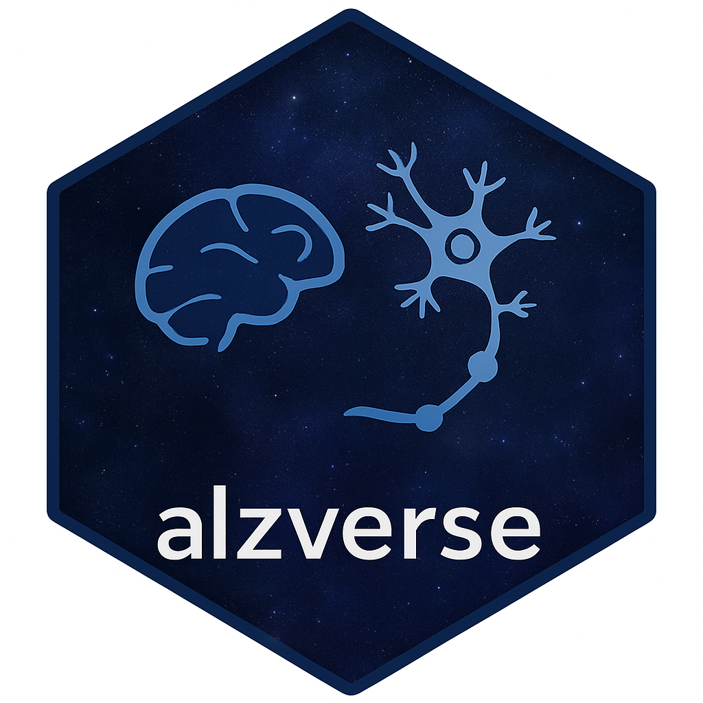

<!-- README.md is generated from README.Rmd. Please edit that file -->

# alzverse <a href="https://atri-biostats.github.io/alzverse/"></a>

## Overview

The `alzverse` is an ecosystem of R packages containing data for
Alzheimer’s research. Documentation can be found at
<https://atri-biostats.github.io/alzverse/>.

## Data Availability

Data is available from:

- `A4LEARN`: [A4StudyData.org](https://A4StudyData.org)
- `ADNIMERGE2`: [loni.usc.edu](https://loni.usc.edu)

Data documentation is available from

- `A4LEARN`:
  [atri-biostats.github.io/A4LEARN/](https://atri-biostats.github.io/A4LEARN)
- `ADNIMERGE2`:
  [atri-biostats.github.io/ADNIMERGE2](https://github.com/atri-biostats/ADNIMERGE2)

## Code Availability

R code is available for download from the following repositories:

- alzverse:
  [github.com/atri-biostats/alzverse](https://github.com/atri-biostats/alzverse)
- A4LEARN:
  [github.com/atri-biostats/A4LEARN](https://github.com/atri-biostats/A4LEARN)
- ADNIMERGE2:
  [github.com/atri-biostats/ADNIMERGE2](https://github.com/atri-biostats/ADNIMERGE2)

## Installation

To install `alzverse`, first download and install:

- `A4LEARN`: [A4StudyData.org](https://A4StudyData.org), and
- `ADNIMERGE2`: [loni.usc.edu](https://loni.usc.edu)

Then run the following steps to download `alzverse` code, build package
locally with merged data, and install `alzverse`:

``` r
# Check if `remotes` is loaded ----
if(!require("remotes", character.only = TRUE)) {
  install.packages("remotes")
}
library(remotes)

# download alzverse tar.gz from github ----
dl <- remote_download(github_remote('atri-biostats/alzverse'))
dl.dir <- dirname(dl)
alzverse_home <- file.path(dl.dir, 'alzverse')

# extract files ----
untar(dl, exdir = dl.dir)
file.rename(file.path(dl.dir, untar(dl, list = TRUE)[1]), alzverse_home)

# build merged data ----
callr::rscript(file.path(alzverse_home, 'data-raw', 'data-prep.R'), 
  wd = alzverse_home)

# build and install package ----
install.packages(alzverse_home, repos = NULL, type = 'source')
```

## Funding

This work is supported by the [Alzheimer’s Clinical Trials Consortium
(ACTC)](https://www.actcinfo.org/) (NIH NIA U24AG057437).

# <a href="https://www.actcinfo.org/"> <a href="https://atri.usc.edu/">
